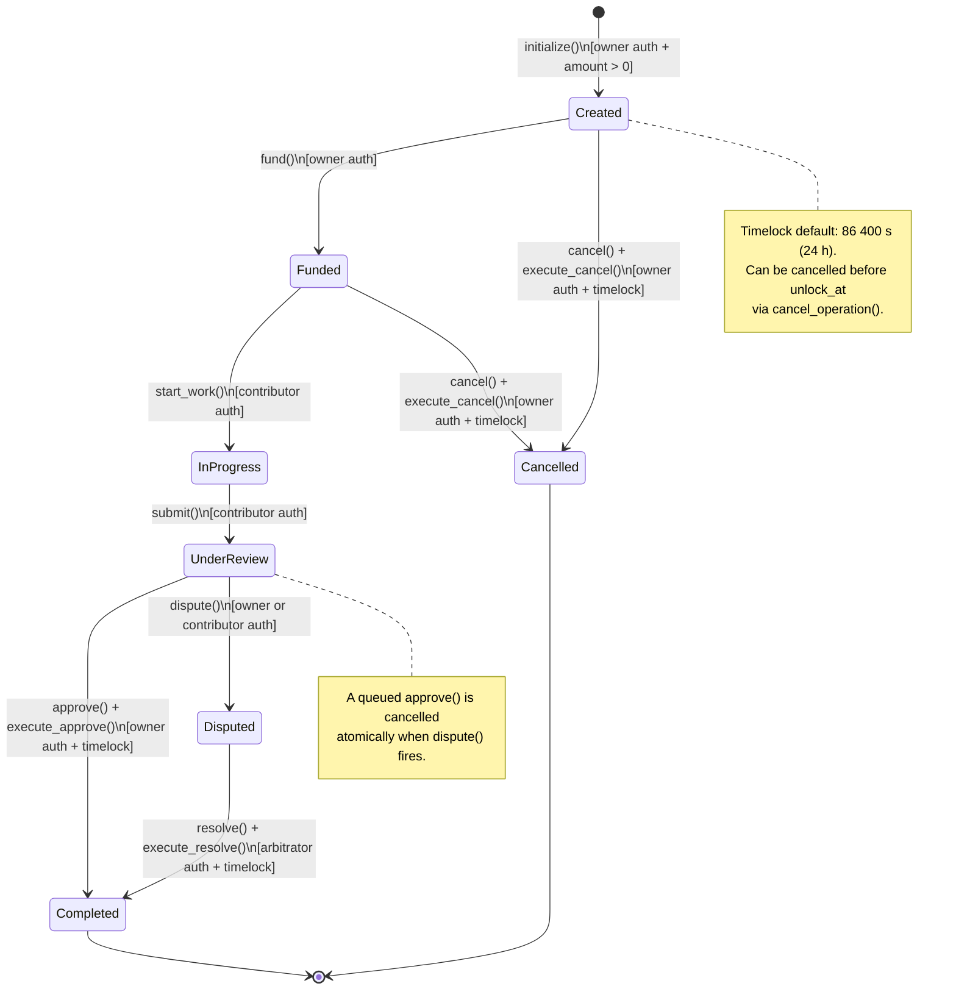

# Bounty State Machine Reference

> **Auto-generated from**: `apps/contracts/src/lib.rs` — `EscrowContract`  
> **Issue**: [#435](https://github.com/BountyOnChain/StellarBounty/issues/435)

---

## Mermaid State Diagram



---

## Transition Table

| # | From State | Event / Function | Guard / Pre-conditions | To State | Payout |
|---|---|---|---|---|---|
| 1 | _(none)_ | `initialize(owner, amount, token, arbitrator, timelock)` | `owner` signed tx; `amount > 0`; contract not yet initialized | **Created** | — |
| 2 | Created | `fund(owner)` | `owner` signed tx; caller == owner | **Funded** | `amount` tokens transferred owner → contract |
| 3 | Funded | `start_work(contributor)` | `contributor` signed tx | **InProgress** | — |
| 4 | InProgress | `submit(contributor)` | `contributor` signed tx; caller == stored contributor | **UnderReview** | — |
| 5 | UnderReview | `approve(owner)` → _(timelock)_ → `execute_approve()` | `owner` signed tx; caller == owner; no pending operation exists; `unlock_at` reached | **Completed** | `amount` tokens transferred contract → contributor |
| 6 | UnderReview | `dispute(caller)` | caller == owner or contributor; signed tx | **Disputed** | — (clears any queued approval) |
| 7 | Disputed | `resolve(arbitrator, winner)` → _(timelock)_ → `execute_resolve()` | `arbitrator` signed tx; caller == arbitrator; `winner` is owner or contributor; `unlock_at` reached | **Completed** | `amount` tokens transferred contract → winner |
| 8 | Created | `cancel(owner)` → _(timelock)_ → `execute_cancel()` | `owner` signed tx; caller == owner; `unlock_at` reached | **Cancelled** | No transfer (never funded) |
| 9 | Funded | `cancel(owner)` → _(timelock)_ → `execute_cancel()` | `owner` signed tx; caller == owner; `unlock_at` reached | **Cancelled** | `amount` tokens refunded contract → owner |
| 10 | Any (pending exists) | `cancel_operation(initiator)` | caller == initiator; `now < unlock_at` | _(same state)_ | — (clears pending queue) |

> **Timelock mechanics**: `approve()`, `cancel()`, and `resolve()` queue a `PendingTimelock` entry.
> The corresponding `execute_*` functions can only run once `ledger.timestamp() >= unlock_at`.
> Only the initiator can call `cancel_operation()` to abort a queued operation before it unlocks.

---

## State Descriptions

| State | Description |
|---|---|
| **Created** | Contract initialized; no funds on-chain yet. |
| **Funded** | Owner has transferred `amount` tokens into the escrow contract. |
| **InProgress** | A contributor has claimed the bounty and is working. |
| **UnderReview** | Contributor has submitted; owner is reviewing the deliverable. |
| **Disputed** | Owner or contributor raised a dispute; arbitrator must resolve. |
| **Completed** | Funds released to contributor (or winner in a dispute). Terminal state. |
| **Cancelled** | Bounty cancelled by owner; funds refunded if previously funded. Terminal state. |

---

## Error Codes

| Code | Name | Trigger |
|---|---|---|
| 1 | `NotInitialized` | Any function called before `initialize()`. |
| 2 | `AlreadyInitialized` | `initialize()` called a second time. |
| 3 | `Unauthorized` | Caller is not the required role (owner / contributor / arbitrator). |
| 4 | `InvalidStatus` | Function called from the wrong state. |
| 5 | `InvalidWinner` | `resolve()` winner is not owner or contributor. |
| 6 | `InsufficientBalance` | Token balance too low for the transfer. |
| 7 | `InvalidAmount` | `amount <= 0` during `initialize()`. |
| 8 | `NoPendingOperation` | `execute_*` called without a queued operation. |
| 9 | `PendingOperationExists` | `approve()` / `cancel()` / `resolve()` called while another operation is queued. |
| 10 | `OperationLocked` | `execute_*` called before `unlock_at`. |
| 11 | `OperationAlreadyUnlocked` | `cancel_operation()` called after the timelock has already expired. |
| 12 | `InvalidOperation` | `execute_approve()` called but queued op is `Cancel`, etc. |

---

## Test Cases per Transition

The following table cross-references each transition with its primary test in `apps/contracts/src/lib.rs`.

| Transition | Test function |
|---|---|
| 1 — initialize | `test_initialize_stores_fields` |
| 1 — invalid amount | `test_initialize_rejects_zero_amount`, `test_initialize_rejects_negative_amount` |
| 1 — re-initialize blocked | `test_reinitialize_after_deploy_errs_to_protect_upgrade_state` |
| 2 — fund | `test_fund_transfers_tokens_and_transitions` |
| 2 — fund unauthorized | `test_fund_by_non_owner_errs` |
| 2 — fund insufficient allowance | `test_fund_with_insufficient_allowance_errs` |
| 2 — fund uninitialized | `test_fund_on_uninitialized_contract_errs` |
| 3 — start_work | `test_start_work_transitions_to_in_progress` |
| 3 — start_work wrong state | `test_start_work_before_funding_errs` |
| 4 — submit | `test_submit_transitions_to_under_review` |
| 4 — submit non-contributor | `test_submit_by_non_contributor_errs` |
| 5 — approve + execute_approve | `test_approve_pays_contributor` |
| 5 — execute_approve before timelock | `test_execute_approve_before_timelock_errs` |
| 5 — execute_approve no pending | `test_execute_approve_without_pending_errs` |
| 5 — cancel_operation halts approve | `test_cancel_operation_halts_queued_approve` |
| 6 — dispute by owner | `test_dispute_by_owner_transitions_to_disputed` |
| 6 — dispute by contributor | `test_dispute_by_contributor_transitions_to_disputed` |
| 6 — dispute cancels queued approve | `test_dispute_halts_queued_approval` |
| 7 — resolve pays contributor | `test_resolve_pays_contributor_and_completes` |
| 8/9 — cancel from Created | `test_cancel_from_created_no_transfer` |
| 9 — cancel from Funded (refund) | `test_cancel_from_funded_refunds_owner` |

---

## Rendering this diagram locally

GitHub natively renders Mermaid inside Markdown. For local preview:

```bash
# Option 1: VS Code with the "Markdown Preview Mermaid Support" extension
code docs/bounty-state-machine.md

# Option 2: CLI via @mermaid-js/mermaid-cli
npx -y @mermaid-js/mermaid-cli -i docs/bounty-state-machine.md -o docs/bounty-state-machine.svg
```
