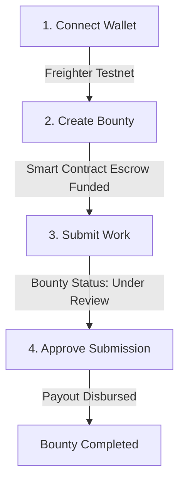

# StellarBounty Contributor Quick-Start Guide

Welcome to the StellarBounty Contributor Quick-Start! This guide is designed to get you from cloning the repository to verifying a fully functioning local setup in under 5 minutes.

---

## 📋 Prerequisites Checklist

Before you start, make sure you have the following installed on your local machine:

- [ ] **Node.js** (v20 or higher) & **npm** (v10 or higher)
- [ ] **Docker** & **Docker Compose**
- [ ] **Git**
- [ ] **Freighter Wallet Extension** (installed in your browser)
- [ ] **Rust & Soroban CLI** (only required if developing smart contracts under `apps/contracts`):
  ```bash
  rustup target add wasm32-unknown-unknown
  cargo install --locked stellar-cli
  ```

---

## ⚡ The One-Liner Local Setup

You can run the entire multi-service stack (PostgreSQL database, NestJS backend, and Next.js frontend) with a single command.

### 1. Clone & Prepare Environment

```bash
git clone https://github.com/BountyOnChain/StellarBounty.git
cd StellarBounty
npm run install:all
cp .env.example .env
```

### 2. Spin Up the Services

Run the multi-service compose command:

```bash
npm run dev:up
```

This starts:
- **PostgreSQL Database** on port `5432`
- **NestJS Backend** on port `4000`
- **Next.js Frontend** on port `3000`

### 3. Verify Health Endpoint

Once the services are up, verify that the backend can connect to the database and Stellar network:

```bash
curl http://localhost:4000/api/v1/health
```

**Expected Response:**
```json
{
  "status": "ok",
  "timestamp": "2026-07-18T20:48:28.000Z",
  "environment": "development",
  "version": "0.1.0",
  "uptime": 12.34,
  "database": "connected",
  "stellarRpc": "connected",
  "contract": "not_configured"
}
```

> [!NOTE]
> A new contributor can hit the **ok** health endpoint after following only these steps!

---

## 🚶 Developer Walkthrough

Here is a step-by-step walkthrough of the core user flow: **Create a Bounty ➔ Connect Wallet ➔ Submit Work ➔ Approve & Disburse**.



### Step 1: Wallet Setup & Network Config

| Browser & Wallet View | Developer Action / Details |
| :--- | :--- |
| **Freighter Extension UI**<br>1. Open Freighter browser extension.<br>2. Select Network: **Testnet** (Settings > Network > Testnet).<br>3. Copy address.<br>4. Fund with Friendbot at [Stellar Laboratory](https://laboratory.stellar.org/#account-creator?network=testnet). | **Connect Wallet to App**<br>Navigate to `http://localhost:3000`. Click the **Connect Wallet** button in the top right. Freighter will prompt for permission to connect. |

### Step 2: Create a Bounty

| Screen / UI Representation | Action Details |
| :--- | :--- |
| **New Bounty Page** (`/bounties/new`) <br> ```text<br>+------------------------------------------+<br>| [New Bounty]                             |<br>| Title: [ Write Playwright tests        ] |<br>| Reward (XLM): [ 900                    ] |<br>| Deadline: [ 2026-09-30                 ] |<br>| Description: [ Cover wallet setup... ]   |<br>|                                          |<br>|            [ Create Bounty ]             |<br>+------------------------------------------+<br>``` | Fill in the bounty requirements and click **Create Bounty**. Freighter will pop up to sign the transaction that initializes the escrow contract. |

### Step 3: Connect Contributor & Submit Work

| Screen / UI Representation | Action Details |
| :--- | :--- |
| **Bounty Details** (`/bounties/bounty-1`) <br> ```text<br>+------------------------------------------+<br>| [Bounty: Write Playwright tests]         |<br>| Status: Open    Reward: 900 XLM          |<br>|                                          |<br>| Submit Work:                             |<br>| Work Link: [ https://github.com/...   ] |<br>| Notes: [ Implemented the tests...      ] |<br>|                                          |<br>|            [ Submit Work ]               |<br>+------------------------------------------+<br>``` | Switch Freighter to your **Contributor** account (or use a separate test account address/wallet). Go to the bounty page and fill in the submission form, then click **Submit work**. |

### Step 4: Approve & Disburse

| Screen / UI Representation | Action Details |
| :--- | :--- |
| **Owner Dashboard** (`/dashboard`) <br> ```text<br>+------------------------------------------+<br>| [Dashboard]                              |<br>| [ My Bounties ]   [ Submitted Work ]     |<br>|                                          |<br>| Bounty: Write Playwright tests            |<br>| Contributor: GCONTRIBUTOR...             |<br>| Submission: https://github.com/...       |<br>|                                          |<br>|      [ Approve ]      [ Dispute ]        |<br>+------------------------------------------+<br>``` | Switch back to the **Owner** wallet. Go to `/dashboard`, click the **My Bounties** tab, review the work, and click **Approve**. This triggers the smart contract payout to the contributor. |

---

## 🧪 Running Tests

Ensure your contributions don't break existing functionality by running the relevant test suites.

### smart Contract Tests (Soroban)
Run the Rust tests for the escrow and arbitrator logic:
```bash
cd apps/contracts
cargo test
# Or run the pre-push gate check script:
./scripts/check-contracts.sh
```

### ⚙️ Backend Services (NestJS)
Run the NestJS unit tests and lint checks:
```bash
# Run unit tests
npm test --workspace=apps/backend

# Run linting
npm run lint --workspace=apps/backend
```

### 🎨 Frontend & E2E (Next.js & Playwright)
Run the Next.js unit tests and full end-to-end user flow integration tests:
```bash
# Run unit tests
npm test --workspace=apps/frontend

# Run Playwright E2E flows (with mock API integration)
npm run test:e2e --workspace=apps/frontend
```
